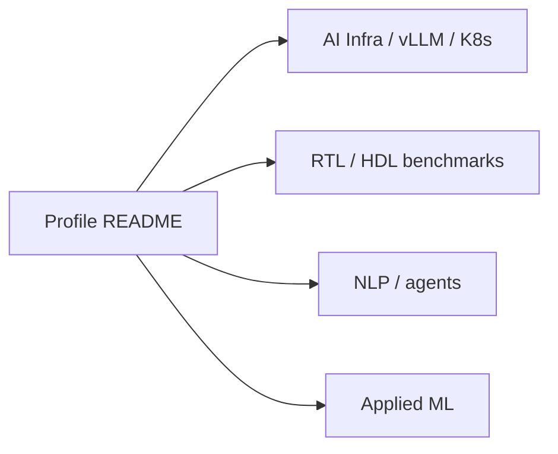

# Archana Chetan

### Special-case profile repository meant to power the GitHub profile landing page.

GitHub profile repos (`username/username`) should introduce the person, skills, and highlighted projects; this one currently only carries a spam README.

Conventionally a single README.md rendered on the profile; here the README was overwritten with portfolio keyword boilerplate unrelated to a personal introduction.

## Focus areas

- Special-case profile repo (username matches owner)

## Profile repo facts

| Metric | Value | Source |
|---|---|---|
| Tracked files | **1** | `git tree` |
| Python modules | **0** | `git tree` |
| Test-related paths | **0** | `git tree` |
| CI workflows | **No** | `.github/workflows` |
| Docker present | **No** | `repo root` |

## Selected public work

Browse repositories: [github.com/ArchanaChetan07?tab=repositories](https://github.com/ArchanaChetan07?tab=repositories)

Themes: **vLLM · Kubernetes · GPU · observability · SystemVerilog / RTL eval · NLP · multi-agent systems · applied ML**

## License

See individual repositories.
